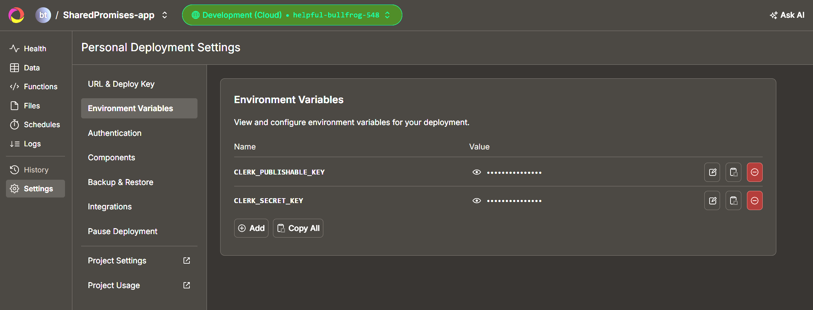
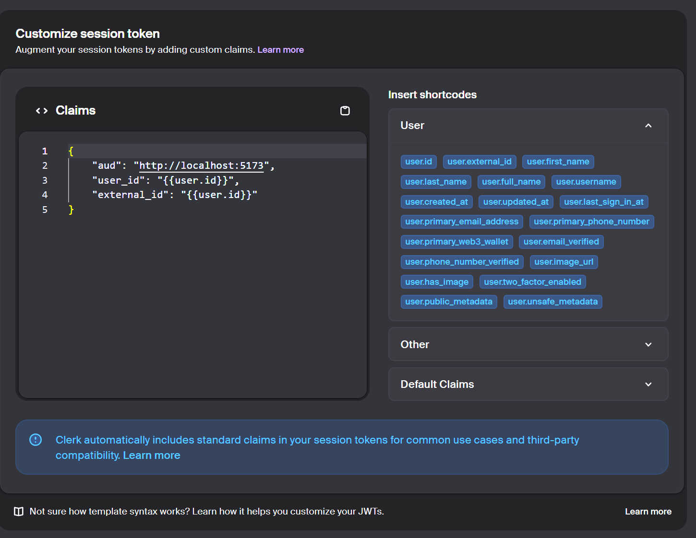

# 🚀 Настройка аутентификации Clerk + Convex

Полный гайд по интеграции **Clerk** и **Convex** для React-проекта.  

---

## 📋 Предварительные требования

- [ ] Установить пакеты:

```bash
npm install convex @convex-dev/clerk @clerk/clerk-react
```

**Создать аккаунты:**

[Clerk Dashboard](https://dashboard.clerk.com/apps) → создать приложение

[Convex Dashboard](https://dashboard.convex.dev/) → создать проект

## 🔧 Шаг 1: Настройка Clerk

**1️⃣ Получите ключи из Clerk Dashboard**

VITE_CLERK_PUBLISHABLE_KEY → начинается с pk_test_...

CLERK_SECRET_KEY → начинается с sk_test_...

**Добавляем их в нижеуказанные места**



**2️⃣ Создайте JWT Template**

Перейдите: JWT Templates → New Template

Имя шаблона: convex (обязательно!)

Claims (JSON):




## ⚙️ Шаг 2: Настройка Convex

**📁 Структура файлов проекта**
- main.tsx 
```bash
import React from "react";
import ReactDOM from "react-dom/client";
import { ClerkProvider, useAuth } from "@clerk/clerk-react";
import { ConvexProviderWithClerk } from "convex/react-clerk";
import { ConvexReactClient } from "convex/react";
import App from "./App";

const convex = new ConvexReactClient(import.meta.env.VITE_CONVEX_URL);

ReactDOM.createRoot(document.getElementById("root")!).render(
  <React.StrictMode>
    <ClerkProvider publishableKey={import.meta.env.VITE_CLERK_PUBLISHABLE_KEY}>
      <ConvexProviderWithClerk client={convex} useAuth={useAuth}>
        <App />
      </ConvexProviderWithClerk>
    </ClerkProvider>
  </React.StrictMode>
);
```

- convex/auth.config.ts
```bash
export default {
  providers: [
    {
      domain: "Clerk Frontend API URL",
      applicationID: "http://localhost:5173",
    },
  ],
};
```

- convex/schema.ts
```bash
import { defineSchema, defineTable } from "convex/server";
import { v } from "convex/values";

export default defineSchema({
    users: defineTable({
    externalId: v.string(),
    role: v.union(
      v.literal("author"),
      v.literal("partner")
    ),
    createdAt: v.number(),
  }).index("by_externalId", ["externalId"]),
});
```

- convex/users.ts
```bash
export const getMe = query({
  args: {},
  handler: async (ctx) => {
    // ДЛЯ ОТЛАДКИ - выводим всю информацию
    console.log("=== GETME CALLED ===");
    
    const identity = await ctx.auth.getUserIdentity();
    console.log("Identity from ctx.auth:", identity);
    
    if (!identity) {
      console.log("No identity - returning null");
      return null;
    }
    
    console.log("Looking for user with externalId:", identity.subject);
    
    const user = await ctx.db
      .query("users")
      .withIndex("by_externalId", q => 
        q.eq("externalId", identity.subject)
      )
      .first();
    
    console.log("Found user:", user);
    return user;
  },
});

export const createMe = mutation({
  args: {
    role: v.union(
      v.literal("author"),
      v.literal("partner")
    ),
  },
  handler: async (ctx, { role }) => {
    console.log("=== CREATEME CALLED ===");
    
    const identity = await ctx.auth.getUserIdentity();
    console.log("Identity in createMe:", identity);
    
    if (!identity) {
      console.error("THROWING: Not authenticated");
      throw new Error("Not authenticated");
    }
    
    // Проверяем, существует ли уже пользователь
    const existingUser = await ctx.db
      .query("users")
      .withIndex("by_externalId", q => 
        q.eq("externalId", identity.subject)
      )
      .first();
    
    if (existingUser) {
      console.log("User already exists, returning existing ID:", existingUser._id);
      return existingUser._id;
    }
    
    // Создаем нового пользователя
    console.log("Creating new user with externalId:", identity.subject);
    const userId = await ctx.db.insert("users", {
      externalId: identity.subject,
      role,
      createdAt: Date.now(),
    });
    
    console.log("Created user with ID:", userId);
    return userId;
  },
});
```

- App.tsx
```bash
import { SignedIn, SignedOut, SignIn } from "@clerk/clerk-react";
import SelectRole from "./pages/SelectRole";
function App() {
  return (
    <>
      <SignedOut>
        <div className="min-h-screen flex items-center justify-center bg-gray-50">
          <SignIn />
        </div>
      </SignedOut>
      
      <SignedIn>
        <SelectRole />
      </SignedIn>
    </>
  );
}

export default App;
```

# 🔍 Шаг 4: Проверка настройки
**Terminal 1: Запуск Convex**
```bash
npx convex dev
```

**Terminal 2: Запуск приложения**
```bash
npm run dev
```